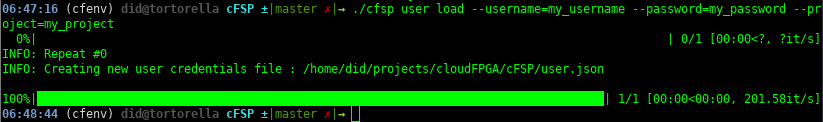
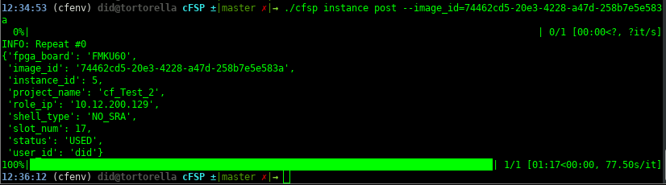

<p align="center">
  <a aria-label="License" href="https://github.com/cloudFPGA/cFSP/blob/master/LICENSE">
    
  </a>
  <a aria-label="PyPi" href="https://pypi.org/project/cfsp/">
    
  </a>
  <a aria-label="Python" href="#cFSP">
    
  </a>
</p>

[](https://jenkins.cloudfpga.zc2.ibm.com/job/cFSP/)

# cFSP

The **cloudFPGA Support Package (cFSP)** for the cloudFPGA project.

Currently, the cFSP includes a library for the control plane of cloudFPGA.

The cFSP control plane includes a [Python package](cFSPlib/python_api_client/README.md) which is automatically generated by the [Swagger Codegen](https://github.com/swagger-api/swagger-codegen) project:

- API version: 0.8
- Package version: 1.0.0

[Instrunctions to update the Python API Client](#update-of-the-python-python-api)

## Requirements

Python 3.6+

## Installation

We recommend the installation at an isolated Python environment, e.g. through [Virtualenv](https://virtualenv.pypa.io).

### Installation through github
Use this option for the most up-to-date installation.

```bash
git clone git@github.com:cloudFPGA/cFSP.git
cd cFSP/
virtualenv -p /usr/bin/python3.8 cfenv
source cfenv/bin/activate
pip install --upgrade pip
pip install -r requirements.txt
```

### Installation through PyPi

We maintain `cFSP` at [PyPi](https://pypi.org/project/cfsp/).
Use this option for fast installation.

```bash
virtualenv -p /usr/bin/python3.8 cfenv
source cfenv/bin/activate
pip install --upgrade pip
pip install cfsp
```

> **_NOTE:_** If you install `cfsp` through `PyPi`, then the top-level script `cfsp` can be executed from any directory location, and not necessarily from the cFSP root path. Thus, in the following commands you should replace `./cfsp` by `cfsp`.

For instrunctions about updating the PyPi package check: [README_pypi.md](README_pypi.md)

## Getting Started

### Contents

* [Getting help](#getting-help).
* [Setting up the credentials file for a user](#setting-up-the-credentials-file-for-a-user).
* [Show the credentials of a user](#show-the-credentials-of-a-user).
* [Load new credentials for a user](#load-new-credentials-for-a-user).
* [Upload an image](#upload-an-image).
* [Upload an image for pr](#upload-an-image-for-partial-reconfiguration).
* [Get an image](#get-an-image).
* [Create a cluster](#create-a-cluster).
* [Create a multi-node cluster](#create-a-multi-node-cluster).
* [Update the nodes of a cluster](#update-the-nodes-of-a-cluster).
* [Get a cluster](#get-a-cluster).
* [Extend a cluster](#extend-a-cluster).
* [Reduce a cluster](#reduce-a-cluster).
* [Restart a cluster](#restart-a-cluster).
* [Debug a cluster](#debug-a-cluster).
* [Delete a cluster](#delete-a-cluster).
* [Create an instance](#create-an-instance).
* [Get an instance](#get-an-instance).
* [Restart an instance](#restart-an-instance).
* [Debug an instance](#debug-an-instance).
* [Delete an instance](#delete-an-instance).
* [Debug using the flight-record data](#debug-using-the-flight-recorder-data).
* [Use cFSP as a Python module](#use-cfsp-as-a-python-module).


A comprehensive example that tests all the supported functions of cFSP is provided in [tests/test_cfsp_module.py](https://github.com/cloudFPGA/cFSP/blob/master/test/test_cfsp_module.py).

### Getting help

Please follow the [installation procedure](#installation--usage) and then run the following:


```bash
./cfsp --help
```


### Setting up the credentials file for a user

Load the credentials for a user. If no credentials file exists, a new one be created. The default filename is `user.json` and it is strored in the cFSP folder. You need to provide your ZYC2 username and password, as well as a project you are member of.

```bash
./cfsp user load  --username=my_username --password=my_password --project=my_project
```



The file has the following JSON format:


> **_NOTE:_** You may provide a specific configuration file instead of the default (user.json), by using the option `-c my_custom_file` (or `--config my_custom_file`), e.g.

```bash
./cfsp user load --config /home/user/user.json
```

### Show the credentials of a user

Show the credentials of a user from a credentials file.

```bash
./cfsp user show
```


### Load new credentials for a user

You can easily load new credentials by:
* either editing the configuration file (e.g. user.json), 
* or by providing any of the supported command line options (`--username`, `--password`, `--project`). In the latter case, the configuration file is being overwritten.

  ```bash
  ./cfsp user load --username=anotherUser  --password=anotherPassword  --project=anotherProject
  ```

  


### Upload an image

Assuming you want to upload the FPGA image which is stored at `/tmp/4_topFMKU60_impl_monolithic.bit`

```bash
./cfsp image post --image_file=4_topFMKU60_impl_monolithic.bit

```


### Upload an image for partial reconfiguration

Assuming you want to upload the FPGA image for pr which is stored at `/tmp/example_files_PR/4_topFMKU60_impl_2_pblock_ROLE_partial.bin`. In that case you will also need the corresponding signature file that was produced by the build (`/tmp/example_files_PR/4_topFMKU60_impl_2_pblock_ROLE_partial.bin.sig`), as well as the result of the pr_verify command `/tmp/example_files_PR/5_topFMKU60_impl_2_pblock_ROLE_partial.rpt`. In addition, a configuration json file is selected by default in the parent folder of the provided image file. An example follows:

```bash
./cfsp image post-app-logic --image_file=/tmp/example_files_PR/4_topFMKU60_impl_2_pblock_ROLE_partial.bin --sig_file=/tmp/example_files_PR/4_topFMKU60_impl_2_pblock_ROLE_partial.bin.sig --pr_verify_rpt=/tmp/example_files_PR/5_topFMKU60_impl_2_pblock_ROLE_partial.rpt

```


Please note that those last two files are automatically selected by default, if only the image file is provided, like in the following example:


### Get an image

Assuming you want to get the details of the previously uloaded FPGA image with id `74462cd5-20e3-4228-a47d-258b7e5e583a`

```bash
./cfsp image get 74462cd5-20e3-4228-a47d-258b7e5e583a
```


### Create a cluster

Assuming you want to create a cluster with
  * one CPU node from ZYC2 with ip=`10.12.2.100`
  * one FPGA from cloudFPGA platform with the previously uloaded FPGA image with id `74462cd5-20e3-4228-a47d-258b7e5e583a`

```bash
./cfsp cluster post --image_id=74462cd5-20e3-4228-a47d-258b7e5e583a --node_ip=10.12.2.100
```


> **_NOTE:_** By using the option `--node_id` after every `--image_id` and `--node_ip`, you can define the specific rank that this CPU node or FPGA node is associated with. If no such (an) option(s) (is)are provided, then incremental `node_id`s will be assigned, as shown in the figure above. Please note that if you provide `--node_id`s, it is mandatory to firstly define those of CPU(s) and secondly of FPGA(s).

> **_NOTE:_** You may want to create many clusters of the previous type. For such cases, there is an extra option `--repeat=<num>`, which specifies how many times the command should be issued. Please note that this applies to all supported commands of `cfsp`, e.g. :

```bash
./cfsp cluster post --image_id=74462cd5-20e3-4228-a47d-258b7e5e583a --node_id 0 --node_ip=10.12.2.100 --node_id 1 --repeat=2

```


### Create a multi-node cluster

You can add to a cluster an arbitrary number of
  * CPU nodes from ZYC2, by using the `--node_ip=` identifier
  * FPGA nodes from cloudFPGA, by using the `--image_id=` identifier

```bash
./cfsp cluster post --image_id=74462cd5-20e3-4228-a47d-258b7e5e583a --image_id=d031b5a9-c3d8-4775-98db-e3de936a63e3  --node_ip=10.12.2.100 --node_ip=10.12.2.101 --node_ip=10.12.2.103 --node_ip=10.12.2.104 --node_ip=10.12.2.105
```


### Update the nodes of a cluster

You can update:
* the images of some or all of the FPGA nodes of a cluster.
* the IPs of some or all CPU nodes of a cluster

For example to update only the image of the `node_id=0`, of the previously created cluster with id `257`, to the `image_id=3f0427af-d37a-453d-b8c4-a813c4573d12`, you may use:

```bash
/cfsp cluster update --cluster_id=257 --node_id=0 --image_id=3f0427af-d37a-453d-b8c4-a813c4573d12
```


And to update only the IP of one of the CPU nodes, e.g. from `10.12.2.103` to `10.12.2.109`, you may use:

```bash
/cfsp cluster update --cluster_id=257 --node_id=4 --node_ip=10.12.2.109
```

> **_NOTE:_** You may use the option `--node_id` as many times as you want to specify the CPU or FPGA nodes of the cluster to update. Depending on the type of the node_id which will be provided, either FPGA or CPU node(s), will be updated. If no `--node_id` argument will be provided, the tool will search for any available FPGA or CPU nodes in the specified `cluster_id`, and it will attempt to update all of them to the specified `image_id` (for FPGA nodes) or `node_ip` (for CPU nodes). Currently there is no option to simultanously update FPGA and CPU nodes of a cluster and an exception will be raised in such an attempt.

### Get a cluster

Assuming you want to get the details of a cluster with id `259`

```bash
./cfsp cluster get 259
```


### Extend a cluster

Assuming you want to extend the previously created cluster with id `259`, with one more FPGA with image id `d031b5a9-c3d8-4775-98db-e3de936a63e3`, and one more CPU node from ZYC2 with ip=`10.12.2.106`.

```bash
./cfsp cluster extend --cluster_id 259 --image_id=d031b5a9-c3d8-4775-98db-e3de936a63e3  --node_id 7 --node_ip=10.12.2.106 --node_id 8
```


> **_NOTE:_** You may extend a cluster with numerous FPGA and CPU nodes by using the `--image_id` and `--node_ip` options. For these nodes you must also provide the rank id through `--node_id` option.


### Reduce a cluster

Assuming you want to reduce the previously extended cluster with id `259`, with the two extra nodes, the FPGA node with `node_id=7` and the CPU node with `node_id=8`.

```bash
./cfsp cluster reduce --cluster_id=259 --node_id 7 --node_id 8
```


### Restart a cluster

Assuming you want to restart a cluster with id `383`

```bash
./cfsp cluster restart 383
```

or


```bash
./cfsp cluster restart --cluster_id=383
```


### Debug a cluster

Assuming you want to debug a cluster with id `383`, by fetching the status information of the 
                                            Network Routing Core of this cluster
                                            
> **_Attention:_** There may be a delay of a few seconds until the counters are updated after 
                         the packets were processed.

```bash
./cfsp cluster get flight_recorder_data cluster 383
```

> Information: The [Themisto Shell](https://github.com/cloudFPGA/cFDK/blob/main/DOC/Themisto.md) is required to obtain these status information.


### Delete a cluster

Assuming you want to delete the previously created cluster with id `259`

```bash
./cfsp cluster delete 259
```


> **_NOTE:_** You may delete all uploaded clusters of a user by not providing a specific cluster id, e.g.

```bash
./cfsp cluster delete
```


### Create an instance

Assuming you want to create an instance with:
  * one FPGA from cloudFPGA platform with the previously uloaded FPGA image with id `74462cd5-20e3-4228-a47d-258b7e5e583a`

```bash
./cfsp instance post --image_id=74462cd5-20e3-4228-a47d-258b7e5e583a
```




> **_NOTE:_** You may want to create many instances of the previous type. For such cases, there is an extra option `--repeat=<num>`, which specifies how many times the command should be issued. Please note that this applies to all supported commands of `cfsp`, e.g. :

```bash
./cfsp instance post --image_id=74462cd5-20e3-4228-a47d-258b7e5e583a --repeat=2
```


### Get an instance

Assuming you want to get the details of the previously created instance with id `5`

```bash
./cfsp instance get 5
```


### Restart an instance

Assuming you want to restart an instance with id `84`

```bash
./cfsp instance restart 84
```


### Debug an instance

Assuming you want to debug an instance with id `84`, by fetching the status information of the 
                                            Network Routing Core of this cluster
                                            
> **_Attention:_** There may be a delay of a few seconds until the counters are updated after 
                         the packets were processed.

```bash
./cfsp cluster get flight_recorder_data instance 84
```

> Information: The [Themisto Shell](https://github.com/cloudFPGA/cFDK/blob/main/DOC/Themisto.md) is required to obtain these status information.


### Delete an instance

Assuming you want to delete the previously created instance with id `5`

```bash
./cfsp instance delete 5
```


> **_NOTE:_** You may delete all uploaded instances of a user by not providing a specific cluster id, e.g.

```bash
./cfsp instance delete
```


### Debug using the flight recorder data

The status information returned by the [Debug a cluster](#debug-a-cluster) or [Debug an instance](#debug-an-instance) commands are called "flight recorder data" and contain a number of status information of each FPGA instance.
The [Themisto Shell](https://github.com/cloudFPGA/cFDK/blob/main/DOC/Themisto.md) is required to obtain these status information.

An example of this flight recorder data is given below:
```json
   "72": [
      "Rank: 12",
      "Size: 23",
      "Last RX port: 2718",
      "Last RX id: 22",
      "Last TX port: 2718",
      "Last TX id: 22",
      "RX packet count: 6026",
      "TX packet count: 4017",
      "cFDK/FMC version: 1.0",
      "FPGA uptime: 17:11:06",
      "current ROLE version: 318",
      "Layer 4 (TCP/UDP) is ENABLED.",
      "Layer 6 (Network Routing) is ENABLED.",
      "Layer 7 (ROLE) is ENABLED.",
      "UDP RX drop count: 0",
      "Invalid node-id/ip-address RX count: 0",
      "Invalid port TX count: 0",
      "Invalid node-id/ip-address TX count: 0",
      "Failed creation of TCP connections (TX) count : 0",
      "TCP RX notif drop count: 0",
      "TCP RX meta drop count: 0",
      "TCP RX data drop count: 0",
      "TCP RX CRC drop count: 0",
      "TCP RX Session drop count: 0",
      "TCP RX Out-of-Order drop count: 0"
    ]
```


The information can be interpreted as follows:

- `Rank`: The rank / node-id of the FPGA instance.
- `Size`: The total size of the FPGA cluster.
- `Last RX port`: The port of the last received UDP packet or TCP connection.
- `Last RX id`: The rank of the last received UDP packet or TCP connection.
- `Last TX port`: The port of the last transmitted UDP packet or TCP connection.
- `Last TX id`: The rank of the last transmitted UDP packet or TCP connection.
- `cFDK/FMC version`: The cFDK version of the configured Shell (c.f. [cfdk.hpp](https://github.com/cloudFPGA/cFDK/blob/main/SRA/LIB/hls/cfdk.hpp)).
- `FPGA uptime`: The time since boot in 24h format.
- `current ROLE version`: The content of the `poSHL_Mmio_RdReg` signal, written by the [Themisto Role.vhdl](https://github.com/cloudFPGA/cFDK/blob/main/DOC/Themisto.md).
- `Layer 4/6/7 ENABLED/DISABLED`: The reset state of the reset layers 4, 6, and 7 (analog the [OSI model](https://en.wikipedia.org/wiki/OSI_model)). The Role is on Layer 7.
- `UDP RX drop count`: *The number of packets dropped by the Shell,* **because the application inside the Role didn't read them fast enough**. The Themisto Shell can store roughly 10KB UDP data in FIFOs (see details [here](https://github.com/cloudFPGA/cFDK/blob/main/DOC/NAL/NAL.md)). If these FIFOs are full, because the Role doesn't read the packets from the NAL interface (or not fast enough), then the Shell drops all further incoming UDP packets, which are counted by the `UDP RX drop count` (until there is sufficient space in the FIFOs again). This happens frequently, if the processes in the Role that are responsible for reading the network traffic, don't have an initial pipeline interval of 1 (i.e. `#pragma HLS pipeline II=1` must be used for these processes). 
- `Invalid node-id/ip-address RX count`: The Role is only allowed to receive packets from IP addresses that are configured within the cluster (FPGA and CPU nodes, see details [here](https://github.com/cloudFPGA/cFDK/blob/main/DOC/Themisto.md#packet-addressing)). If packets are received from different ip addresses, they are dropped and this counter is increased.
- `Invalid port TX count`: The Themisto Shell can only send (and receive) to ports in a given range (see details [here](https://github.com/cloudFPGA/cFDK/blob/main/DOC/Themisto.md#port-opening)), if the Role wants to send a packet to a port outside this range, the default port (i.e. `2718`) is used instead and this counter is increased. This counter is for UDP packets and TCP connections.
- `Invalid node-id/ip-address TX count`: The Role is only allowed to send packets to IP addresses that are configured within the cluster (FPGA and CPU nodes, see details [here](https://github.com/cloudFPGA/cFDK/blob/main/DOC/Themisto.md#packet-addressing)). If packets are received from different ip addresses, they are dropped and this counter is increased.
- `Failed creation of TCP connections (TX) count`: This counter is increased if the initialization of a new TCP connection timed out. This happens if the Role want's to connect to an IP address in the cluster (otherwise the invalid counter above is increased), but the contacted node is not listening on the requested port. 
- `TCP RX * drop count`: These counters are for debugging the TCP stack and NAL layer in the Shell. If they are not 0 and you loose *TCP* (not UDP) packets, please contact developers.


All counters in the flight recorder data are reset if the Role is reset, as done by the [Restart a cluster](#restart-a-cluster) and [Restart an instance](#restart-an-instance) commands.


### Use cFSP as a Python module

cFSP is both a standalone command-line tool as well as a Python module that can be imported to a 
Python file. This allows the integration of cFSP into programming or CI/CD flows.

To use cFSP as a Python module you need to import the `cFSP` module from the 
`cFSPlib` library, like below:

```
import sys

# make sure cFSPlib's folder is in the PYTHONPATH, or add a line as below
sys.path.append("../")

from cFSPlib import cFSP
```

Then you can use the `main` function of the `cFSP` module for all the supported cFSP capabilities.
The option arguments and commands are inherinted from `args=docopt(cFSP.__doc__)`. Then the desired 
arguments and command can be provided through the folllowing:

```
args['<command>'] = 'put_a_command_here'
args['<put_an_option>'] = ['put_the_value_of_that_option']
```


## Update of the python Python API

In case that a new yaml swagger file is available (e.g. when new fields/features are added in the 
swagger yaml), then a new Python API client needs to be generated. This will replace the existing one. 
To generate a new Python API Client you need the `swagger-codegen` tool which can be downloade at 
https://swagger.io/tools/swagger-codegen/. Then you may use this command:

```
swagger-codegen generate -i http://10.12.0.132:8080/swagger.json -l python -o python_api_client
```

Afterwads the generated folder `python_api_client` can replace the existing one in 
https://github.com/cloudFPGA/cFSP/tree/master/cFSPlib/python_api_client 
(e.g. `cp -r ./python_api_client/* cFSP/cFSPlib/python_api_client/`).


