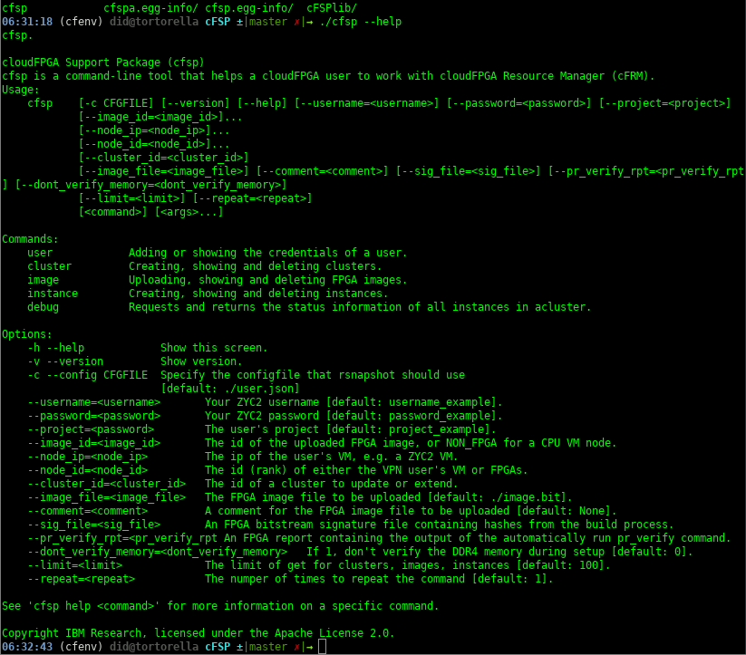

[](https://jenkins.cloudfpga.zc2.ibm.com/job/cFSP/)

# cFSP

The **cloudFPGA Support Package (cFSP)** for the cloudFPGA project.

Currently, the cFSP includes a library for the control plane of cloudFPGA.

The cFSP control plane includes a [Python package](cFSPlib/python_api_client/README.md) which is automatically generated by the [Swagger Codegen](https://github.com/swagger-api/swagger-codegen) project:

- API version: 0.8
- Package version: 1.0.0

## Requirements

Python 3.6+

## Installation

We recommend the installation at an isolated Python environment, e.g. through [Virutalenv](https://virtualenv.pypa.io).

### Installation through github
Use this option for the most up-to-date installation.

```bash
git clone git@github.com:cloudFPGA/cFSP.git
cd cFSP/
virtualenv -p /usr/bin/python3.8 cfenv
source cfenv/bin/activate
pip install --upgrade pip
pip install -r requirements.txt
```

### Installation through PyPi

We maintain `cFSP` at [PyPi](https://pypi.org/project/cfsp/).
Use this option for fast installation.

```bash
virtualenv -p /usr/bin/python3.8 cfenv
source cfenv/bin/activate
pip install --upgrade pip
pip install cfsp
```

> **_NOTE:_** If you install `cfsp` through `PyPi`, then the top-level script `cfsp` can be executed from any directory location, and not necessarily from the cFSP root path. Thus, in the following commands you should replace `./cfsp` by `cfsp`.

## Getting Started

### Contents

* [Getting help](#getting-help).
* [Setting up the credentials file for a user](#setting-up-the-credentials-file-for-a-user).
* [Show the credentials of a user](#show-the-credentials-of-a-user).
* [Load new credentials for a user](#load-new-credentials-for-a-user).
* [Upload an image](#upload-an-image).
* [Upload an image for pr](#upload-an-image-for-partial-reconfiguration).
* [Get an image](#get-an-image).
* [Create a cluster](#create-a-cluster).
* [Create a multi-node cluster](#create-a-multi-node-cluster).
* [Get a cluster](#get-a-cluster).
* [Delete a cluster](#delete-a-cluster).
* [Create an instance](#create-an-instance).
* [Get an instance](#get-an-instance).
* [Delete an instance](#delete-an-instance).


### Getting help

Please follow the [installation procedure](#installation--usage) and then run the following:


```bash
./cfsp --help
```



### Setting up the credentials file for a user

Load the credentials for a user. If no credentials file exists, a new one be created. The default filename is `user.json` and it is strored in the cFSP folder. You need to provide your ZYC2 username and password, as well as a project you are member of.

```bash
./cfsp user load  --username=my_username --password=my_password --project=my_project
```


The file has the following JSON format:


> **_NOTE:_** You may provide a specific configuration file instead of the default (user.json), by using the option `-c my_custom_file` (or `--config my_custom_file`), e.g.

```bash
./cfsp user load --config /home/user/user.json
```

### Show the credentials of a user

Show the credentials of a user from a credentials file.

```bash
./cfsp user show
```


### Load new credentials for a user

You can easily load new credentials by:
* either editing the configuration file (e.g. user.json), 
* or by providing any of the supported command line options (`--username`, `--password`, `--project`). In the latter case, the configuration file is being overwritten.

  ```bash
  ./cfsp user load --username=anotherUser  --password=anotherPassword  --project=anotherProject
  ```

  


### Upload an image

Assuming you want to upload the FPGA image which is stored at `/tmp/4_topFMKU60_impl_monolithic.bit`

```bash
./cfsp image post --image_file=4_topFMKU60_impl_monolithic.bit

```


### Upload an image for partial reconfiguration

Assuming you want to upload the FPGA image for pr which is stored at `/tmp/example_files_PR/4_topFMKU60_impl_2_pblock_ROLE_partial.bin`. In that case you will also need the corresponding signature file that was produced by the build (`/tmp/example_files_PR/4_topFMKU60_impl_2_pblock_ROLE_partial.bin.sig`), as well as the result of the pr_verify command `/tmp/example_files_PR/5_topFMKU60_impl_2_pblock_ROLE_partial.rpt`. In addition, a configuration json file is selected by default in the parent folder of the provided image file. An example follows:

```bash
./cfsp image post-app-logic --image_file=/tmp/example_files_PR/4_topFMKU60_impl_2_pblock_ROLE_partial.bin --sig_file=/tmp/example_files_PR/4_topFMKU60_impl_2_pblock_ROLE_partial.bin.sig --pr_verify_rpt=/tmp/example_files_PR/5_topFMKU60_impl_2_pblock_ROLE_partial.rpt

```


Please note that those last two files are automatically selected by default, if only the image file is provided, like in the following example:


### Get an image

Assuming you want to get the details of the previously uloaded FPGA image with id `74462cd5-20e3-4228-a47d-258b7e5e583a`

```bash
./cfsp image get 74462cd5-20e3-4228-a47d-258b7e5e583a
```


### Create a cluster

Assuming you want to create a cluster with
  * one CPU node from ZYC2 with ip=`10.12.2.100`
  * one FPGA from cloudFPGA platform with the previously uloaded FPGA image with id `74462cd5-20e3-4228-a47d-258b7e5e583a`

```bash
./cfsp cluster post --image_id=74462cd5-20e3-4228-a47d-258b7e5e583a --node_ip=10.12.2.100
```


> **_NOTE:_** You may want to create many clusters of the previous type. For such cases, there is an extra option `--repeat=<num>`, which specifies how many times the command should be issued. Please note that this applies to all supported commands of `cfsp`, e.g. :

```bash
./cfsp cluster post --image_id=74462cd5-20e3-4228-a47d-258b7e5e583a --node_ip=10.12.2.100 --repeat=2
```


### Create a multi-node cluster

You can add to a cluster an arbitrary number of
  * CPU nodes from ZYC2, by using the `--node_ip=` identifier
  * FPGA nodes from cloudFPGA, by using the `--image_id=` identifier

```bash
./cfsp cluster post --image_id=74462cd5-20e3-4228-a47d-258b7e5e583a --image_id=d031b5a9-c3d8-4775-98db-e3de936a63e3  --node_ip=10.12.2.100 --node_ip=10.12.2.101 --node_ip=10.12.2.103 --node_ip=10.12.2.104 --node_ip=10.12.2.105
```


### Get a cluster

Assuming you want to get the details of the previously created cluster with id `259`

```bash
./cfsp cluster get 259
```


### Delete a cluster

Assuming you want to delete the previously created cluster with id `259`

```bash
./cfsp cluster delete 259
```


> **_NOTE:_** You may delete all uploaded clusters of a user by not providing a specific cluster id, e.g.

```bash
./cfsp cluster delete
```


### Create an instance

Assuming you want to create an instance with:
  * one FPGA from cloudFPGA platform with the previously uloaded FPGA image with id `74462cd5-20e3-4228-a47d-258b7e5e583a`

```bash
./cfsp instance post --image_id=74462cd5-20e3-4228-a47d-258b7e5e583a
```


> **_NOTE:_** You may want to create many instances of the previous type. For such cases, there is an extra option `--repeat=<num>`, which specifies how many times the command should be issued. Please note that this applies to all supported commands of `cfsp`, e.g. :

```bash
./cfsp instance post --image_id=74462cd5-20e3-4228-a47d-258b7e5e583a --repeat=2
```


### Get an instance

Assuming you want to get the details of the previously created instance with id `5`

```bash
./cfsp instance get 5
```


### Delete an instance

Assuming you want to delete the previously created instance with id `5`

```bash
./cfsp instance delete 5
```


> **_NOTE:_** You may delete all uploaded instances of a user by not providing a specific cluster id, e.g.

```bash
./cfsp instance delete
```


